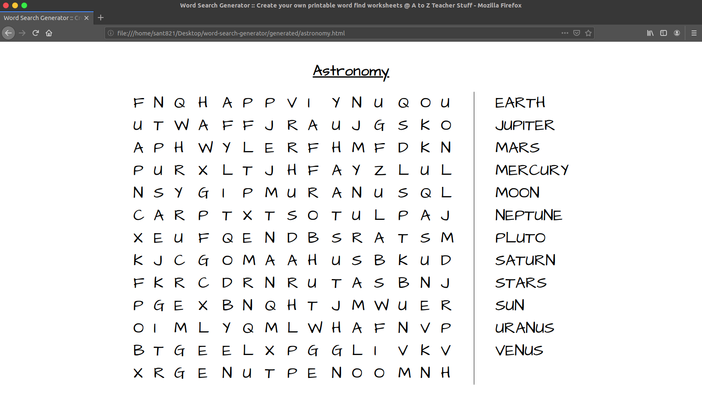

# Word Search Game

Simple application to create and print your word search games using Yaml files.

# Installation

## npm
```bash
npm install word-search-game -g
```

## Yarn
```bash
yarn global add word-search-game
```

# Getting Started

* Create a folder called `schemas` at the root of this project
* Place your Yaml files inside `schemas`

Yaml files should follow this structure:

```yml
title: Any title
words:
    - Word1
    - Word2
    - Word3
    - ...
```
* Call `word-search-game` in a terminal, you should get a prompt of the files that reside in the `schemas` folder.
* Select your file and wait till generation completes, after that it will open a browser with the game ready to be printed.
* The game will be in `generated` folder following `.html` format.

That's it!

I highly recommend to create up to 15 words. This will fit perfectly in a `letter` sheet in landscape mode.

# How it works? 

This application is a wrapper of this [webpage](https://tools.atozteacherstuff.com/word-search-maker/wordsearch.php). Config like number of rows and columns can be set at `./lib/default-form-data.js`.

# Examples

From this Yaml file:

```yml
title: Astronomy
words:
  - Sun
  - Mercury
  - Venus
  - Earth
  - Mars
  - Jupiter
  - Saturn
  - Uranus
  - Neptune
  - Pluto
  - Moon
  - Stars
```

The game will look like this:



# Contributing

If you think this project can be improved, create a PR! 

# License

[MIT](LICENSE)